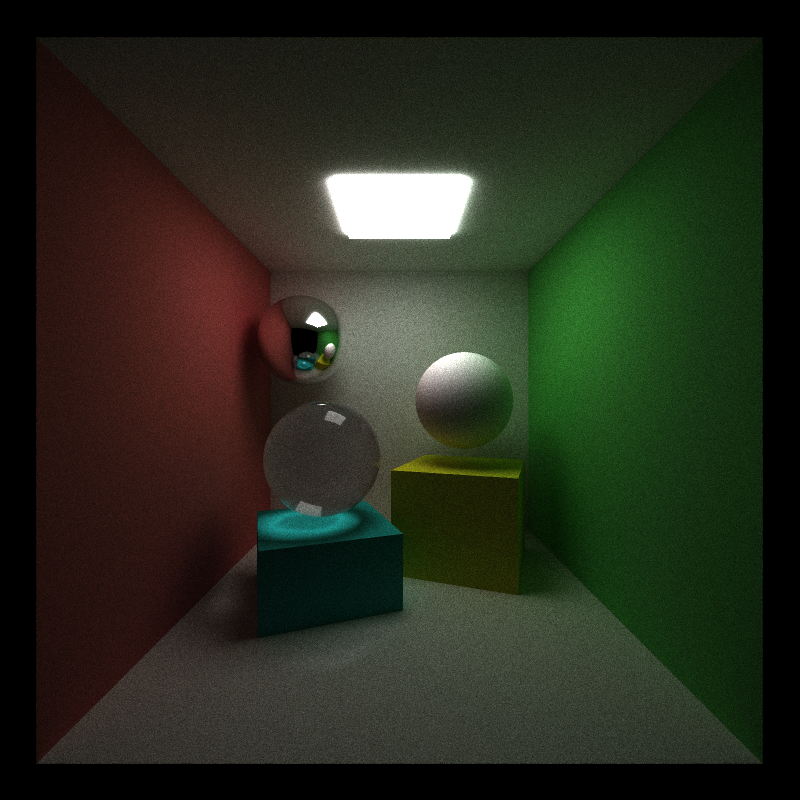
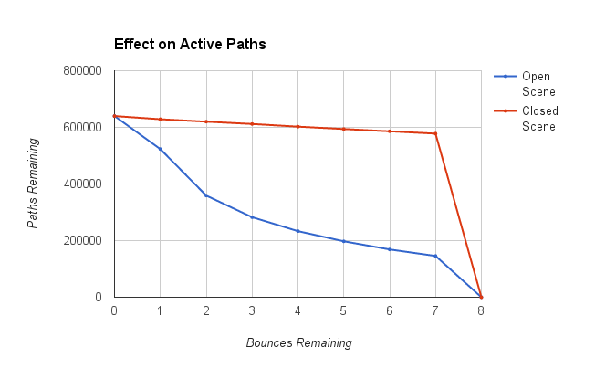
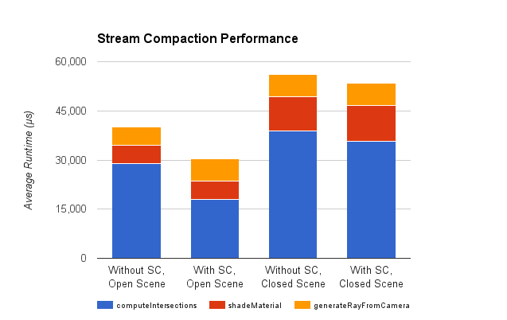
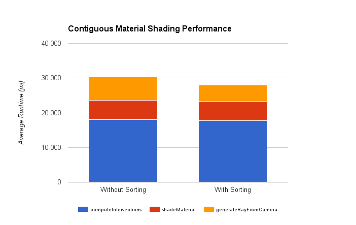
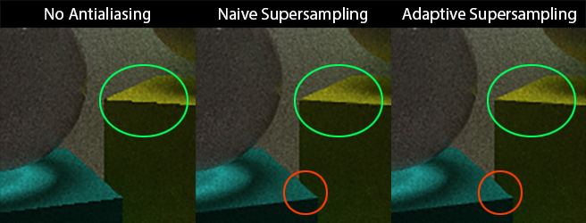
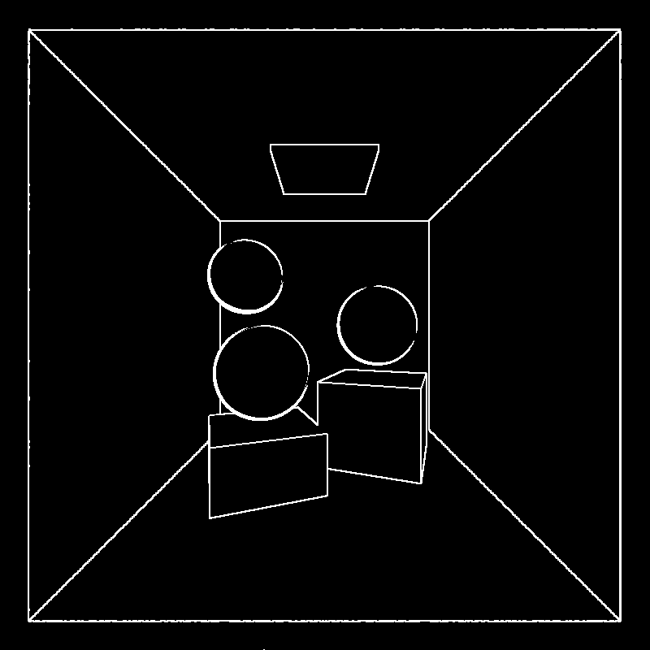
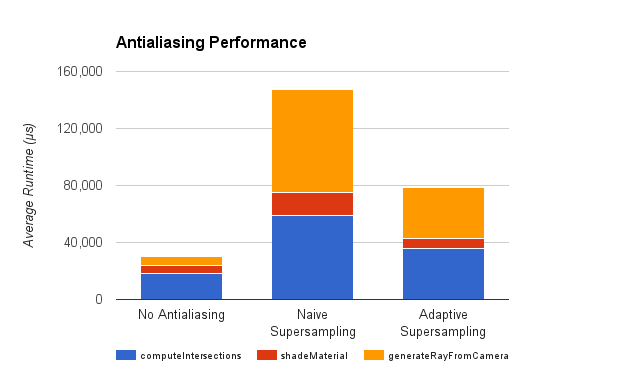
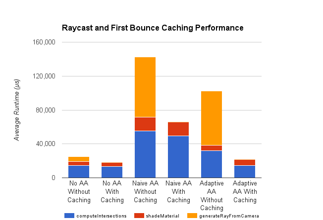

CUDA Path Tracer
================

**University of Pennsylvania, CIS 565: GPU Programming and Architecture, Project 3**

* Richard Lee
* Tested on: Windows 7, i7-3720QM @ 2.60GHz 8GB, GT 650M 4GB (Personal Computer)

## Features

* Diffuse, Reflective, and Refractive (with Fresnel) Materials
* Stream compaction
* Raycast cache optimization
* Stochastic supersampling
* Adaptive supersampling

#### Materials

The shading kernel deals with diffuse, perfect specular, and refractive materials. Fresnel effects for the glass material were implemented using Schlick's Approximation.

#### Stream Compaction

Stream compaction allowed for a significant increase in performance in open scenes, as large portions of the path pool were able to leave the scene and terminate without needing to be processed on subsequent bounces. However, as we can see, stream compaction had much less effect on a closed scene, in which the paths would only terminate prematurely if they happened to hit a light.

 

#### Contiguous Material Shading

Sorting the materials before each shading pass had very little effect on the average runtime of the shading stage, possibly due to the small number of materials used in the test scene. However, sorting the materials themselves led to a significant hit on the overall performance of each iteration, and this optimization would most likely be detrimental without a much larger scene.

#### Stochastic Supersampling and Adaptive Supersampling

Antialiasing was implemented through supersampling, in which pixels were divided into 4 quadrants, with a jittered ray cast through each subpixel. This method effectively renders the image at 4x resolution, reducing any aliasing artifacts.
However, while supersampling allowed for antialiasing, it also required 4 times as many paths, and was much less efficient in terms of memory and time taken for the raycast.

In order to address the fact that most supersampled pixels would not actually fix any aliasing artifacts, adaptive antialiasing was implemented to only supersample pixels which were located at edges where aliasing was likely to occur. The edge pass was generated by analyzing the normals of each pixel relative to its neighbors. This method led to a significant improvement in performance, with a minimal sacrifice in quality. However, there were still some artifacts in the adaptive supersampling method which could be addressed with a more robust edge detection algorithm.

#### Raycast and First Bounce Caching

The rays cast from the supersampling stage were generated the same way each time in order to store the first raycast and intersection. This had marginal benefits without antialiasing, but had significant improvements for the antialiasing methods, as reusing the cache allowed for the expensive raycast to be skipped on subsequent iterations.

